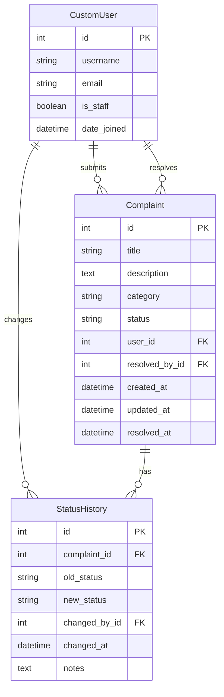

# Design Document: Complaint/Feedback Management System

## Overview

The Complaint/Feedback Management System extends the existing Django application with complaint lifecycle management capabilities. The system leverages the existing CustomUser model and authentication infrastructure while adding new models, views, and templates for complaint management. The design follows Django's Model-View-Template (MVT) pattern and implements role-based access control using Django's built-in permissions system.

## Architecture

### System Architecture

The system follows Django's standard architecture with these key components:

```
┌─────────────────┐    ┌─────────────────┐    ┌─────────────────┐
│   Templates     │    │     Views       │    │     Models      │
│                 │    │                 │    │                 │
│ - complaint_*   │◄──►│ - ComplaintView │◄──►│ - Complaint     │
│ - admin_*       │    │ - AdminView     │    │ - CustomUser    │
│ - dashboard_*   │    │ - DashboardView │    │                 │
└─────────────────┘    └─────────────────┘    └─────────────────┘
         │                       │                       │
         └───────────────────────┼───────────────────────┘
                                 │
                    ┌─────────────────┐
                    │   URL Routing   │
                    │                 │
                    │ - /complaints/  │
                    │ - /admin/       │
                    │ - /dashboard/   │
                    └─────────────────┘
```

### Integration with Existing System

The design integrates with existing components:
- **CustomUser Model**: Extended with role identification methods
- **Authentication Views**: Existing login/signup/logout functionality
- **Base Templates**: Extended for consistent UI across complaint features
- **URL Configuration**: New complaint URLs added to existing structure

## Components and Interfaces

### Models

#### Complaint Model
```python
class Complaint(models.Model):
    CATEGORY_CHOICES = [
        ('technical', 'Technical Issue'),
        ('service', 'Service Quality'),
        ('billing', 'Billing Issue'),
        ('general', 'General Feedback'),
    ]
    
    STATUS_CHOICES = [
        ('open', 'Open'),
        ('in_progress', 'In Progress'),
        ('resolved', 'Resolved'),
    ]
    
    id = models.AutoField(primary_key=True)
    title = models.CharField(max_length=200)
    description = models.TextField()
    category = models.CharField(max_length=20, choices=CATEGORY_CHOICES)
    status = models.CharField(max_length=20, choices=STATUS_CHOICES, default='open')
    user = models.ForeignKey(CustomUser, on_delete=models.CASCADE, related_name='complaints')
    created_at = models.DateTimeField(auto_now_add=True)
    updated_at = models.DateTimeField(auto_now=True)
    resolved_by = models.ForeignKey(CustomUser, on_delete=models.SET_NULL, null=True, blank=True, related_name='resolved_complaints')
    resolved_at = models.DateTimeField(null=True, blank=True)
```

#### StatusHistory Model
```python
class StatusHistory(models.Model):
    complaint = models.ForeignKey(Complaint, on_delete=models.CASCADE, related_name='status_history')
    old_status = models.CharField(max_length=20)
    new_status = models.CharField(max_length=20)
    changed_by = models.ForeignKey(CustomUser, on_delete=models.CASCADE)
    changed_at = models.DateTimeField(auto_now_add=True)
    notes = models.TextField(blank=True)
```

### Views Architecture

#### User Views
- **ComplaintListView**: Display user's complaints with filtering
- **ComplaintDetailView**: Show individual complaint details
- **ComplaintCreateView**: Handle complaint submission
- **ComplaintUpdateView**: Allow editing of unresolved complaints
- **UserDashboardView**: User's main complaint dashboard

#### Admin Views
- **AdminComplaintListView**: Display all complaints with admin controls
- **AdminComplaintDetailView**: Admin view with status management
- **ComplaintDeleteView**: Handle complaint deletion with confirmation
- **AdminDashboardView**: Administrative overview and statistics

### Forms

#### ComplaintForm
```python
class ComplaintForm(forms.ModelForm):
    class Meta:
        model = Complaint
        fields = ['title', 'description', 'category']
        widgets = {
            'description': forms.Textarea(attrs={'rows': 5}),
        }
```

#### StatusUpdateForm
```python
class StatusUpdateForm(forms.Form):
    status = forms.ChoiceField(choices=Complaint.STATUS_CHOICES)
    notes = forms.CharField(widget=forms.Textarea, required=False)
```

### URL Structure

```
/complaints/
├── list/                    # User complaint list
├── create/                  # Submit new complaint
├── <id>/                   # Complaint detail view
├── <id>/edit/              # Edit complaint
└── admin/
    ├── list/               # Admin complaint list
    ├── <id>/               # Admin complaint detail
    ├── <id>/status/        # Update complaint status
    └── <id>/delete/        # Delete complaint
```

## Data Models

### Entity Relationship Diagram



### Data Validation Rules

1. **Complaint Title**: Required, maximum 200 characters
2. **Complaint Description**: Required, minimum 10 characters
3. **Category**: Must be one of predefined choices
4. **Status**: Must follow valid transitions (Open → In Progress → Resolved)
5. **User Association**: Every complaint must be associated with a valid user
6. **Status History**: Every status change must be logged with timestamp and user

## Correctness Properties

*A property is a characteristic or behavior that should hold true across all valid executions of a system—essentially, a formal statement about what the system should do. Properties serve as the bridge between human-readable specifications and machine-verifiable correctness guarantees.*
### Property 1: User Registration and Authentication
*For any* valid user registration data, creating an account should result in successful authentication and access to user features
**Validates: Requirements 1.1, 1.2**

### Property 2: Session Management
*For any* authenticated user, logging out should terminate their session and prevent access to protected features
**Validates: Requirements 1.3**

### Property 3: Authentication Security
*For any* invalid login credentials, the system should reject authentication and display appropriate error messages without revealing sensitive information
**Validates: Requirements 1.4**

### Property 4: Complaint Creation Completeness
*For any* valid complaint data submitted by an authenticated user, the system should create a complaint record with unique ID, "Open" status, timestamp, and proper user association
**Validates: Requirements 2.2, 2.4, 2.5**

### Property 5: Complaint Validation
*For any* incomplete or invalid complaint data, the system should reject submission and display appropriate validation errors
**Validates: Requirements 2.3**

### Property 6: User Complaint Isolation
*For any* user accessing their complaint dashboard, only complaints submitted by that user should be displayed
**Validates: Requirements 3.1**

### Property 7: Complaint Detail Completeness
*For any* complaint viewed by its owner or an admin, all required details (title, description, category, status, dates, history) should be displayed
**Validates: Requirements 3.2, 4.2**

### Property 8: Edit Permission Control
*For any* complaint, users should be able to edit it if and only if it is not resolved and they are the original submitter
**Validates: Requirements 3.3, 3.4, 5.3**

### Property 9: Admin Complaint Access
*For any* admin user, accessing the admin dashboard should display all complaints from all users with complete information
**Validates: Requirements 4.1, 4.2**

### Property 10: Complaint Filtering and Search
*For any* filter or search criteria applied by an admin, only complaints matching those criteria should be returned in results
**Validates: Requirements 4.3, 4.4**

### Property 11: Status Change Audit Trail
*For any* status change made by an admin, the system should record the change with timestamp, admin identifier, old status, new status, and maintain complete history
**Validates: Requirements 5.2, 5.4, 6.3**

### Property 12: Status Transition Validation
*For any* status change attempt, only valid transitions (Open → In Progress → Resolved) should be allowed
**Validates: Requirements 5.5**

### Property 13: Complaint Deletion Completeness
*For any* complaint deletion confirmed by an admin, the complaint and all associated data should be permanently removed from the system
**Validates: Requirements 6.1, 6.2**

### Property 14: Role-Based Access Control
*For any* user attempting to access admin functions, access should be granted if and only if they have admin privileges
**Validates: Requirements 7.1, 7.2, 7.3**

### Property 15: Security Event Logging
*For any* unauthorized access attempt, the system should log the security event and display appropriate error messages
**Validates: Requirements 7.4**

### Property 16: Data Persistence Round Trip
*For any* complaint data stored in the system, retrieving it should return accurate and complete information matching what was originally stored
**Validates: Requirements 8.1, 8.4**

### Property 17: Referential Integrity
*For any* complaint in the system, it should maintain valid references to existing users (submitter and resolver)
**Validates: Requirements 8.3**

## Error Handling

### Validation Errors
- **Form Validation**: Client-side and server-side validation for all user inputs
- **Data Integrity**: Database constraints prevent invalid data states
- **User Feedback**: Clear, actionable error messages for validation failures

### Authentication Errors
- **Invalid Credentials**: Secure error messages that don't reveal user existence
- **Session Expiry**: Graceful handling of expired sessions with redirect to login
- **Permission Denied**: Clear messaging when users attempt unauthorized actions

### System Errors
- **Database Errors**: Graceful degradation with user-friendly error pages
- **Concurrent Access**: Django's built-in handling of concurrent database operations
- **File System Errors**: Proper error handling for any file operations

### Error Logging
- **Security Events**: Log all authentication failures and unauthorized access attempts
- **System Errors**: Comprehensive logging for debugging and monitoring
- **User Actions**: Audit trail for all significant user actions (complaint creation, status changes, deletions)

## Testing Strategy

### Dual Testing Approach

The system will employ both unit testing and property-based testing for comprehensive coverage:

**Unit Tests** focus on:
- Specific examples and edge cases
- Integration points between Django components
- Error conditions and validation scenarios
- Template rendering and form processing

**Property Tests** focus on:
- Universal properties that hold for all inputs
- Comprehensive input coverage through randomization
- Business rule validation across all data combinations
- Security and access control verification

### Property-Based Testing Configuration

- **Testing Library**: Use Hypothesis for Python/Django property-based testing
- **Test Iterations**: Minimum 100 iterations per property test
- **Test Tagging**: Each property test tagged with format: **Feature: complaint-management-system, Property {number}: {property_text}**
- **Data Generation**: Custom generators for User, Complaint, and StatusHistory models
- **Database Integration**: Use Django's TestCase with database rollback for each test

### Unit Testing Balance

Unit tests complement property tests by providing:
- Specific workflow examples (registration → login → complaint submission)
- Edge case validation (empty forms, invalid data, boundary conditions)
- Integration testing between views, forms, and templates
- Django-specific functionality (middleware, authentication, permissions)

Property tests provide comprehensive coverage by:
- Testing business rules across all possible input combinations
- Validating security properties with generated attack scenarios
- Ensuring data integrity across all CRUD operations
- Verifying role-based access control with various user configurations

### Test Organization

```
tests/
├── test_models.py          # Model validation and relationships
├── test_views.py           # View logic and permissions
├── test_forms.py           # Form validation and processing
├── test_properties.py      # Property-based tests for all correctness properties
└── test_integration.py     # End-to-end workflow testing
```

Each correctness property will be implemented as a single property-based test that validates the universal behavior described in the property statement.